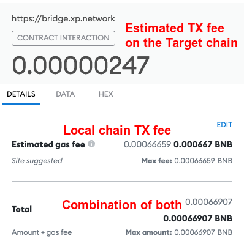

# Exchange Rate Oracle (ERO)

**Oracles** are distributed off-chain nodes feeding information to the smart contracts. A *set* of oracles can be represented as $O_\delta = \{o_1, ..., o_n\}$.

**Resilience** of the *set* is achieved through the *Byzantine fault tolerance* consensus. The *set* functions properly relying on the $2/3*n + 1$ benevolent oracles, while $n/3-1$ can be down or controlled by imaginary malicious adversaries.

The XP.network ERO is responsible for collecting & providing the USD equivalent for the supported currencies.

## Supported Cryptocurrencies

| Coin | Blockchain |
|:-:|:-:|:-:|
|XPNET|TBN |
|EGLD|Elrond|
|HT|HECO|
|BNB|BSC|
|ETH|Ethereum|
|AVAX|Avalanche|
|MATIC|Polygon |
|FTM|Fantom |
|ONE|Harmony |
|TRX|Tron |
|CELO|Celo |
|ONT|Ontology |
|STAKE|Stake |
|ALGO|Algorand |
|FUSE|Fuse |
|XTZ|Tezos |
|VLX|Velas |

## Efficiency

To reduce the number of requests & ensure fast response, the tool caches the received batch result for 1 hour.

If the new batch is not available after the expiration of the hour, the 1+ hour long rate is returned.

## Result

The tool returns the exchange rate quotent of the two arbitrary Supported Currencies.

| Term | Cryptocurrencies |
|:-:|:-:|
| $Divided$ | The foreign coin |
| $Dividend$ | The native coin |
| $Quotent$ | $1st / 2nd$ |

We can multiply the fee estimation by the quotent and get the fee in the native currency.

## Example

A bridge user is sending an NFT from BSC to Velas. 

| Term | Cryptocurrencies | Actual figures | USD Equivalent |
|:-:|:-:|:-:|:-:|:-:|
| Divided | VLX | 1 | $0.3257 |
| Dividend | BSC | 1 | $465.35 |
| Quotent |  1VLX /  1 BNB | 0.00069990329 | - |
| Fee Estimation | in VLX | 0.00352905894 | $ 0.0011494145 |
| The user sees | | 0.00000247 BNB | $ 0.0011494145 |

So, when a user is confirming the transaction in Metamask this is what (s)he will see:

In fact, the user may pay even less. 
1. The TX fee on BNB 0.000441595 BNB
2. The fee on the target chain (Velas) 0.000002471877613277 BNB 
3. Sum total: 0.00044406687 BNB ($ 0.20664652149)

Here's the transaction details on the Binance Smart Chain Explorer:

