# Bridge Walkthrough

The document consists of a number of steps a user can take to send NFTs from one chain to another. 
XP.network bridge is the first of the kind NFT multi-chain bridge connecting 12+ blockchains where 4 are non EVM chains.

> ###  1. Ethereum (EVM)
> ###  2. BSC (EVM)
> ###  3. Avalanche (EVM)
> ###  4. Polygon (EVM)
> ###  5. Algorand (Non-EVM)
> ###  6. Fantom (EVM)
> ###  7. Tron (Semi-EVM)
> ###  8. Elrond (Non-EVM)
> ###  9. Tezos (Non-EVM)
> ###  10. Velas (EVM)
> ###  11. xDai (EVM)
> ###  12. Fuse (EVM)

## 1. The Initial Page
On the initial page, a user can:
1. Select the chain of ***departure*** where the NFT(s) are located from the list of the supported networks. (See above).
2. Select the chain of ***destination*** where the user wants to send the NFT(s) to. (Same list excluding the chain of departure).

**NB**: 
    a. The user has to ***own*** the NFTs to be able to send them.
    b. The smart contract of the NFT must be whitelisted by XP.network for the bridge to accept it. This protects the users' assets and the bridge infrastructure from malicious smart contracts.

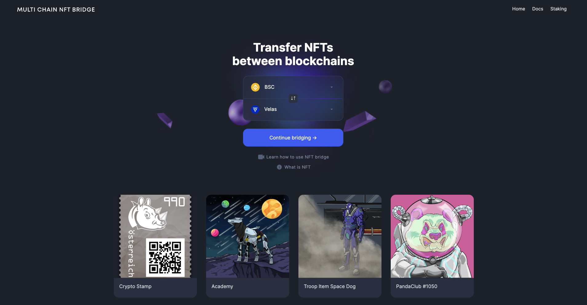

## 2. Connecting the wallet

The bridge supports the wallets compatible with the integrated blockchains. Active buttons with the logo and the name of the wallets indicate that the wallet is compatible with the chain of departure and can be selected.

The inactive buttons with greyish font color and blurred wallet logos indicate that the wallets are incompatible with the chain of departure therefore, the user is protected from accidentally selecting a wrong wallet.

When a wallet is selected from the list, the user account is injected in the bridge allowing the user to view NFTs and sign transactions on the chain of departure.

XP.network NFT Bridge Supported wallets:

<table style="text-align:center">
    <thead style="background-color:grey;">
        <tr>
            <th>Logo</th>
            <th>Wallet Name</th>
            <th>Supported Chains</th>
        </tr>
    </thead>
    <tbody>
        <tr>
            <td style="background-color:grey">
                
            </td>
            <td><a href="https://metamask.io/">MetaMask</a></td>
            <td>Desktop support for the EVM chains: Ethereum, BSC, Avalanche, Polygon, Fantom, Velas, xDai, Fuse</td>
        </tr>
        <tr>
            <td style="background-color:grey">
                
            </td>
            <td><a href="https://walletconnect.com/registry/wallets">WalletConnect</a></td>
            <td>
                Mobile support for the wallets: 
                MetaMask, TrustWallet, fuse.cash, 
            </td>
        </tr>
        <tr>
            <td style="background-color:grey">
                
            </td>
            <td><a href="https://trustwallet.com/assets">TrustWallet</a></td>
            <td>Mobile support for: Ethereum, BSC, Solana, Avalanche, Polygon, Tron, Tezos, Fantom, Elrond, xDai, VeChain, Algorand, NEAR, and many more </td>
        </tr>
        <tr>
            <td style="background-color:grey">
                
            </td>
            <td><a href="https://wallet.myalgo.com/home">MyAlgo</a></td>
            <td>Algorand</td>
        </tr>
        <tr>
            <td style="background-color:grey">
                   
            </td>
            <td><a href="https://www.purestake.com/technology/algosigner/">Algo Signer</a></td>
            <td>Algorand</td>
        </tr>
        <tr>
            <td style="background-color:grey">
                
            </td>
            <td><a href="https://www.tronlink.org/">TronLink</a></td>
            <td>Tron</td>
        </tr>
        <tr>
            <td style="background-color:grey">
                
            </td>
            <td><a href="https://maiar.com/">Maiar</a></td>
            <td>Elrond (mobile)</td>
        </tr>
        <tr>
            <td style="background-color:grey">
                
            </td>
            <td><a href="https://chrome.google.com/webstore/detail/maiar-defi-wallet/dngmlblcodfobpdpecaadgfbcggfjfnm">Maiar Extension</a></td>
            <td>Elrond (desktop)</td>
        </tr>
        <tr>
            <td style="background-color:grey">
                
            </td>
            <td><a href="https://www.ledger.com/">Ledger</a</td>
            <td>Hardware Ledger cold wallet</td>
        </tr>
        <tr>
            <td style="background-color:grey">
                
            </td>
            <td><a href="https://trezor.io/">Trezor</a></td>
            <td>Hardware Trezor cold wallet</td>
        </tr>
    </tbody>
</table>

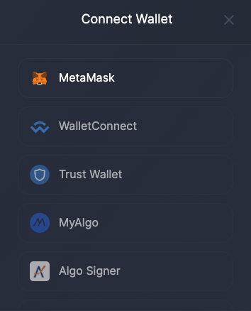 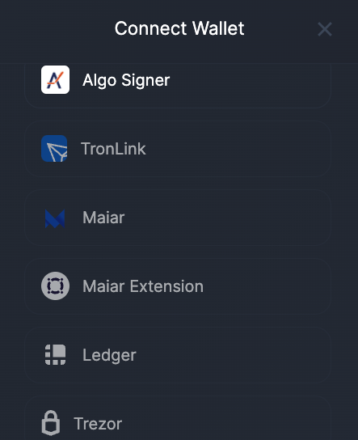

## 3. Viewing NFTs

XP.network has developed a tool called "***NFT Indexer***". It allows viewing NFTs by two parameters:
1. The blockchain of interest
2. The Public Key of the NFT owner

**How it works**:
1. XP.network has looped through the blocks of the integrated blockchins since their genesis.
2. We read the transactions of the blocks.
3. If a transaction was NFT minting, transferring or burning related, we saved the new owner of the NFT in our database togeather with the information about that NFT.

**The main bridging screen allows to**:
1. Select one or multiple NFTs
2. View NFT metadata
3. Provide the bridge with the address of the receiver on the target chain
4. Approve in the original NFT smart contract that the new **operator** is the bridge SC
5. Transfer one or multiple NFTs to the chain of destination

**Example:**

In this example we're sending one NFT called "Unifairy" ID: 10002366816 from BSC to Velas to the same address. 

EVM chains use the same elliptical curve cryptography which allows reusing the same key pairs on multiple chains. In other words, we can have the same account accross all the EVM blockchains and use the same private key for signing our transactions.

## 4. Signing the bridging transaction

The Sender of the NFT(s) pays for the transactions on the local and the target chains in the native currency. It is very convenient for the payer. The bridge takes the burden of exchanging the coins in the background providing a smooth user experience. 

The local and the foreign transaction fees are shown separately in the wallet for the clarity of the signer. The native chain gas fees are withdrawn by the blockchain to award the validators for their work. The foreign chain fees are collected by the bridge smart contract for reimbursing the costs of the bridge oracles, who pay in the target chain coins for submitting the bridge transactions.

## 5. Viewing the Results of Bridging

Once the signature has been accepted the bridge will display the Transaction screen. There a user can click on the "View Txn" button to see the Transaction on the Explorer of the chain of departure.

In the explorer of the departure chain a user can find more information about the transaction and get the third party confirmation of success in the chain of origin. It is also possible to see the actual paid amount of the transaction fee which can be even less than the estimation in the wallet.

If a user controlls the account on the target chain (s)he can use the bridge to check whether the NFTs have arrived to the destination. If an asset was sent to an account the sender does not controll, there's always a possibility to look up the asset in the explorer of the target network by the address of the receiver. Ususally the last transactions will be related with the recently bridged NFT.

Since the bridge only displays the tokens of the departure chain the user needs to select what was previously the chain of destination in the departure chain dropdown box. (In our example Velas was the network of destination, now we're choosing it as the departure chain). 

Because we are setting the bridge only to see the results, it does not matter what we choose as the destination chain. For example, we can choose BSC.

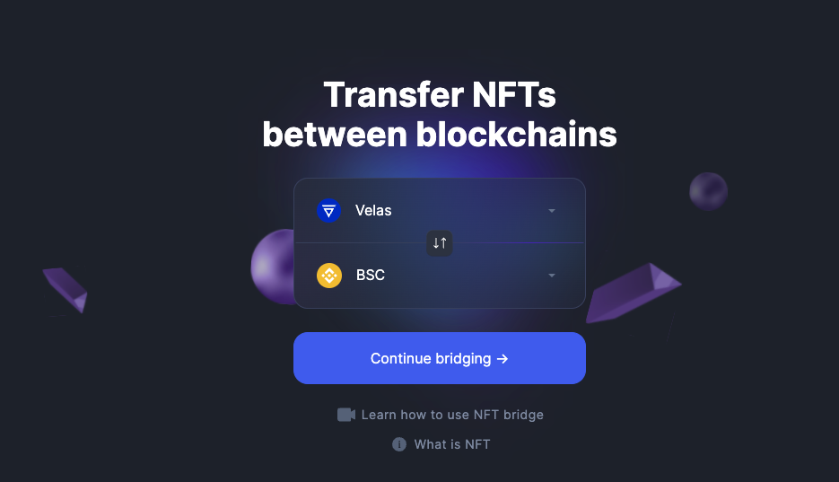

While changing networks you will see a notification like this. Press the "Switch Network" button. 

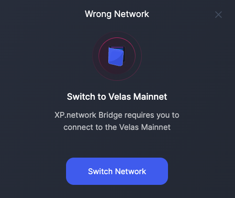

Confirm connection to the new blockchain in the wallet. Press the "Switch Network" button. 

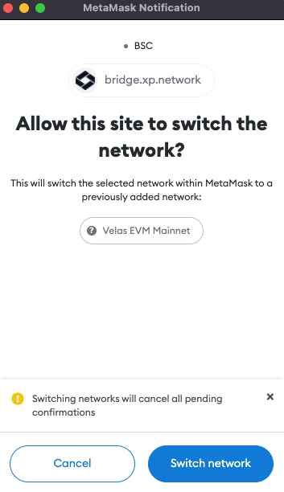

The Unifairy NFT has successfully arrived from BSC to Velas. However, we can see that its ID has changed to 17. This is the ID of the wrapped NFT in the smart contract it was minted with on the target chain.

Thanks to the new smart contracts developed by XP.network, it is possible to mint wrapped NFTs with arbitrary addresses on the target chain. This fundamental change allows transferring logic togeather with the assets.

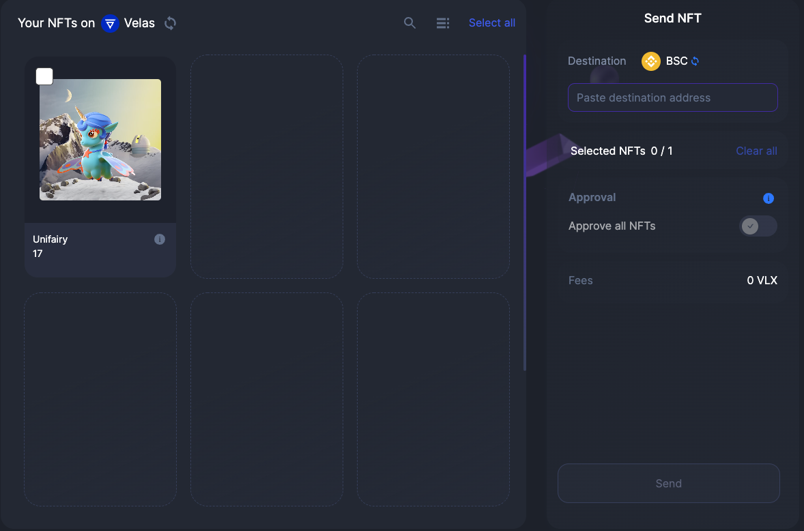

To make sure the wrapped NFT is linked to the original one a user can click the (i) button to view its metadata.

The wrapped copy's metadata has additional fields:

1. Original Chain (BSC in this case)
2. Original chain nonce (the internal bridge ID of the chain, nonce stands for a "number used once")
3. Original URI - the link to original NFT metadata

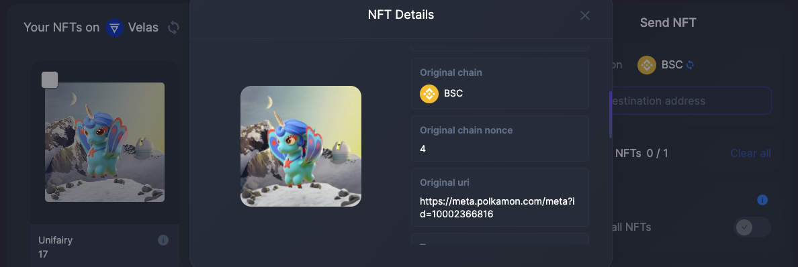

The link to the initial metadata allows to view the original NFT properties assigned at the time of minting or during the process of interacting with the asset, for example in a game.

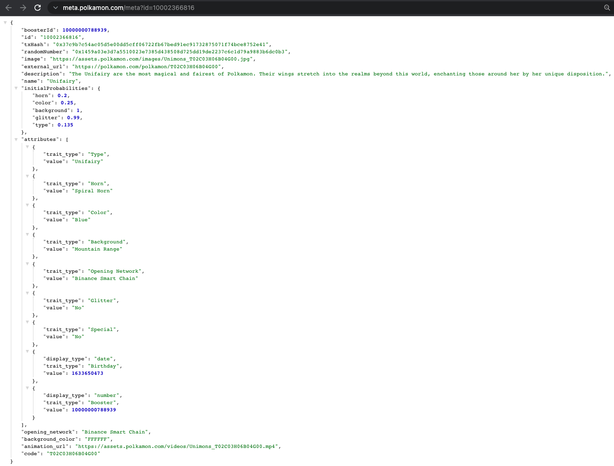

Wrapped NFT metadata holds the same values as the original one. Additionally there's an inner object called "wrapped". We will take a closer look at this object.

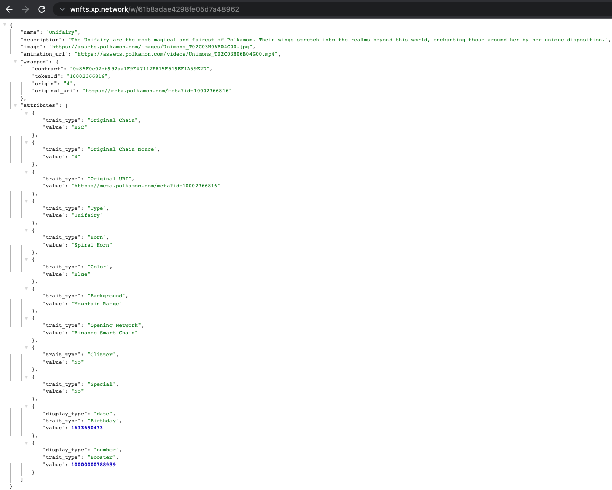

The new "wrapped" object "*remembers*" the following crucial information about the original:
1. The smart contract address
2. The ID the original NFT had in its native chain.
3. Original chain nonce (the internal bridge ID of the chain, BSC is #4)
4. The origina URI linking to the original metadata

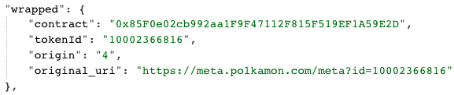

In order to unwrap the NFT it must be sent to the native blockchain using the XP.network bridge. This is the only way since the original is locked in the bridge smart contract which will only release the asset to an arbitrary address following the instructions of the bridge relay validators (oracles.)

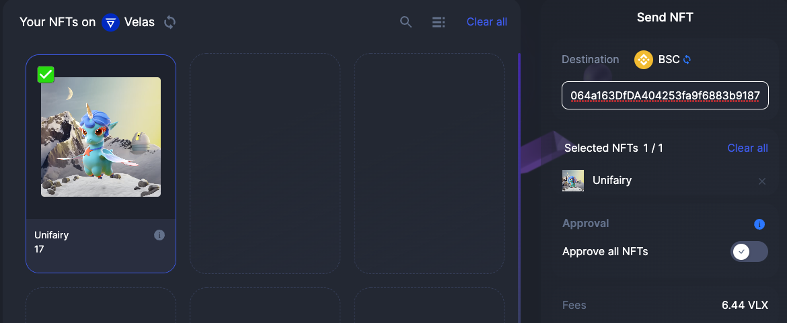

# FAQ

> ## What NFT standards does the bridge support?

At the moment of writing the bridge supports:

1. ERC-721/BEP-721/TRC-721 in the EVM compatible blockchains
2. ESDT for Elrond
3. ASA-003 for Algorand
4. FA2 for Tezos

ERC-1155 smart contract support is developed and audited. We're currently working on implementing it in all the other components of the bridge. So, stay tuned.

> ## Are the royalties preserved on the target chain?

On the chain of origin the NFT is locked in the bridge SC and is a part of the smart contract where it was minted, so any attached logic applies to it.

On the target chain to support any logic, including royalties the wrapped NFT should be minted with the smart contract that has the required logic.

This will be possible with latest smart contracts we have recently developed. It will be the first bridge that allows transferring logic togeather with the NFTS.

> ## Why is smart contract whitelisting required

Many blockchain industry related cyber attacks involve maliciously crafted smart contracts. To reduce the impact area of the bridge infrastructure to interaction with trusted smart contracts whitelisting is essential.

> ## How to whitelist a smart contract for the bridge to accept it?

In order for a smart contract to be whitelisted there are several steps:

1. The smart contract must be verified on the chain and its source code readable
2. An e-mail with a request should be sent to dima@xp.network and kint@xp.network:
    The message should contain the following information:
   1. Blockchain name(Ethereum, BSC, Avalanche, Polygon, etc.)
   2. Smart contract address
   3. Approximate number of NFTs planned for sending
3. XP.network team members will look through the source code of the NFT smart contract
4. The smart contract will be whitelisted or the initiator will be notified that the smart contract has the code that can harm the bridge therefore, it cannot be whitelisted.
