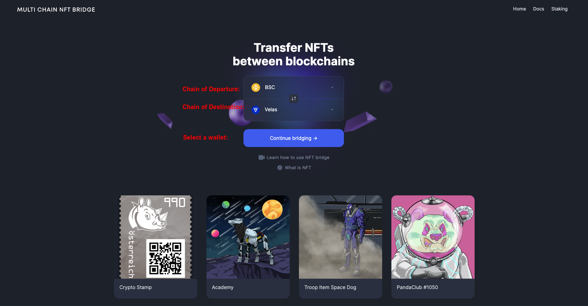
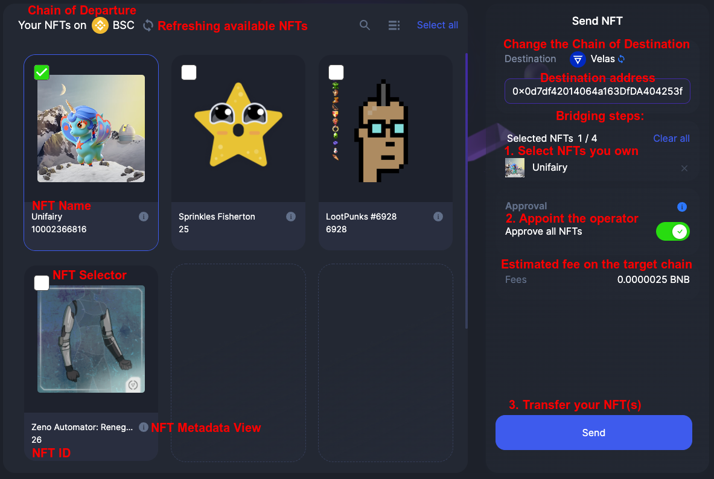
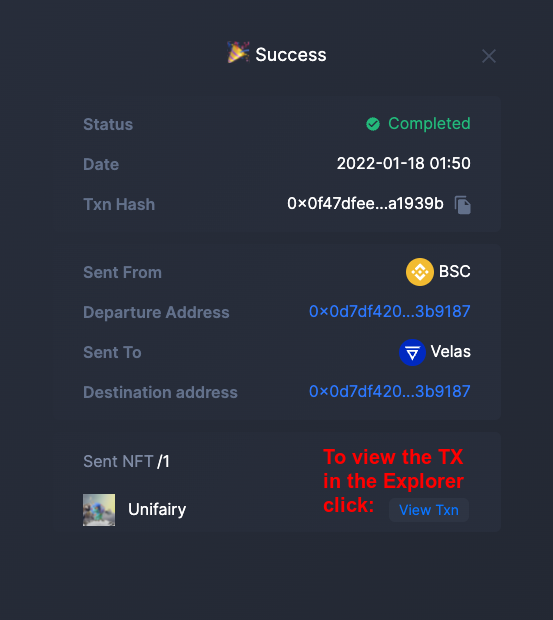

# Bridge Walkthrough

The document consists of a number of steps a user can take to send NFTs from one chain to another. 
XP.network bridge is the first of the kind NFT multi-chain bridge connecting 12+ blockchains where 4 are non EVM chains.

> ###  1. Ethereum (EVM)
> ###  2. BSC (EVM)
> ###  3. Avalanche (EVM)
> ###  4. Polygon (EVM)
> ###  5. Algorand (Non-EVM)
> ###  6. Fantom (EVM)
> ###  7. Tron (Semi-EVM)
> ###  8. Elrond (Non-EVM)
> ###  9. Tezos (Non-EVM)
> ###  10. Velas (EVM)
> ###  11. xDai (EVM)
> ###  12. Fuse (EVM)

## 1. The Initial Page
On the initial page, a user can:
1. Select the chain of ***departure*** where the NFT(s) are located from the list of the supported networks. (See above).
2. Select the chain of ***destination*** where the user wants to send the NFT(s) to. (Same list excluding the chain of departure).

**NB**: 
    a. The user has to ***own*** the NFTs to be able to send them.
    b. The smart contract of the NFT must be whitelisted by XP.network for the bridge to accept it. This protects the users' assets and the bridge infrastructure from malicious smart contracts.

## 2. Connecting the wallet

The bridge supports the wallets compatible with the integrated blockchains. Active buttons with the logo and the name of the wallets indicate that the wallet is compatible with the chain of departure and can be selected.

The inactive buttons with greyish font color and blurred wallet logos indicate that the wallets are incompatible with the chain of departure therefore, the user is protected from accidentally selecting a wrong wallet.

When a wallet is selected from the list, the user account is injected in the bridge allowing the user to view NFTs and sign transactions on the chain of departure.

XP.network NFT Bridge Supported wallets:

<table style="text-align:center">
    <thead style="background-color:grey;">
        <tr>
            <th>Logo</th>
            <th>Wallet Name</th>
            <th>Supported Chains</th>
        </tr>
    </thead>
    <tbody>
        <tr>
            <td style="background-color:grey">
                
            </td>
            <td><a href="https://metamask.io/">MetaMask</a></td>
            <td>Desktop support for the EVM chains: Ethereum, BSC, Avalanche, Polygon, Fantom, Velas, xDai, Fuse</td>
        </tr>
        <tr>
            <td style="background-color:grey">
                
            </td>
            <td><a href="https://walletconnect.com/registry/wallets">WalletConnect</a></td>
            <td>
                Mobile support for the wallets: 
                MetaMask, TrustWallet, fuse.cash, 
            </td>
        </tr>
        <tr>
            <td style="background-color:grey">
                
            </td>
            <td><a href="https://trustwallet.com/assets">TrustWallet</a></td>
            <td>Mobile support for: Ethereum, BSC, Solana, Avalanche, Polygon, Tron, Tezos, Fantom, Elrond, xDai, VeChain, Algorand, NEAR, and many more </td>
        </tr>
        <tr>
            <td style="background-color:grey">
                
            </td>
            <td><a href="https://wallet.myalgo.com/home">MyAlgo</a></td>
            <td>Algorand</td>
        </tr>
        <tr>
            <td style="background-color:grey">
                   
            </td>
            <td><a href="https://www.purestake.com/technology/algosigner/">Algo Signer</a></td>
            <td>Algorand</td>
        </tr>
        <tr>
            <td style="background-color:grey">
                
            </td>
            <td><a href="https://www.tronlink.org/">TronLink</a></td>
            <td>Tron</td>
        </tr>
        <tr>
            <td style="background-color:grey">
                
            </td>
            <td><a href="https://maiar.com/">Maiar</a></td>
            <td>Elrond (mobile)</td>
        </tr>
        <tr>
            <td style="background-color:grey">
                
            </td>
            <td><a href="https://chrome.google.com/webstore/detail/maiar-defi-wallet/dngmlblcodfobpdpecaadgfbcggfjfnm">Maiar Extension</a></td>
            <td>Elrond (desktop)</td>
        </tr>
        <tr>
            <td style="background-color:grey">
                
            </td>
            <td><a href="https://www.ledger.com/">Ledger</a</td>
            <td>Hardware Ledger cold wallet</td>
        </tr>
        <tr>
            <td style="background-color:grey">
                
            </td>
            <td><a href="https://trezor.io/">Trezor</a></td>
            <td>Hardware Trezor cold wallet</td>
        </tr>
    </tbody>
</table>

 

## 3. Viewing NFTs

XP.network has developed a tool called "***NFT Indexer***". It allows viewing NFTs by two parameters:
1. The blockchain of interest
2. The Public Key of the NFT owner

**How it works**:
1. XP.network has looped through the blocks of the integrated blockchins since their genesis.
2. We read the transactions of the blocks.
3. If a transaction was NFT minting, transferring or burning related, we saved the new owner of the NFT in our database togeather with the information about that NFT.

The main bridging screen allows to:
1. Select one or multiple NFTs
2. View NFT metadata
3. Provide the bridge with the address of the receiver on the target chain
4. Approve in the original NFT smart contract that the new **operator** is the bridge SC
5. Transfer one or multiple NFTs to the chain of destination

## 4. Signing the bridging transaction

The Sender of the NFT(s) pays for the transactions on the local and the target chains in the native currency. It is very convenient for the payer. The bridge takes the burden of exchanging the coins in the background providing a smooth user experience. 

The local and the foreign transaction fees are shown separately in the wallet for the clarity of the signer. The native chain gas fees are withdrawn by the blockchain to award the validators for their work. The foreign chain fees are collected by the bridge smart contract for reimbursing the costs of the bridge oracles, who pay in the target chain coins for submitting the bridge transactions.

## 5. Viewing the Results of Bridging

Once the signature has been accepted the bridge will display the Transaction screen. There a user can click on the "View Txn" button to see the Transaction on the Explorer of the chain of departure.

